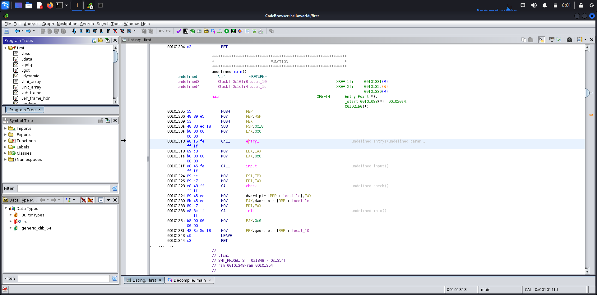
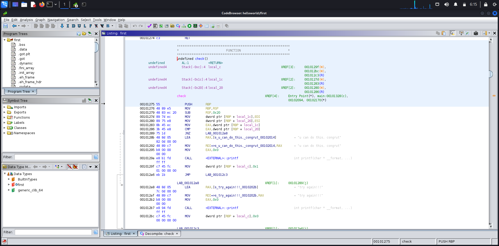
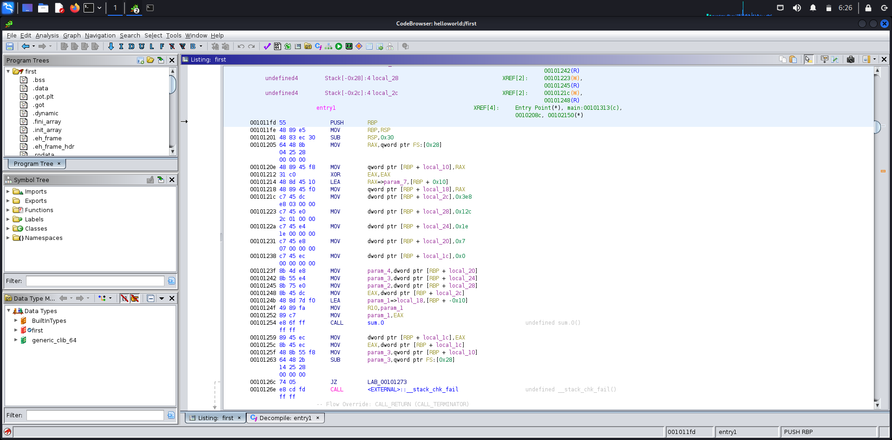
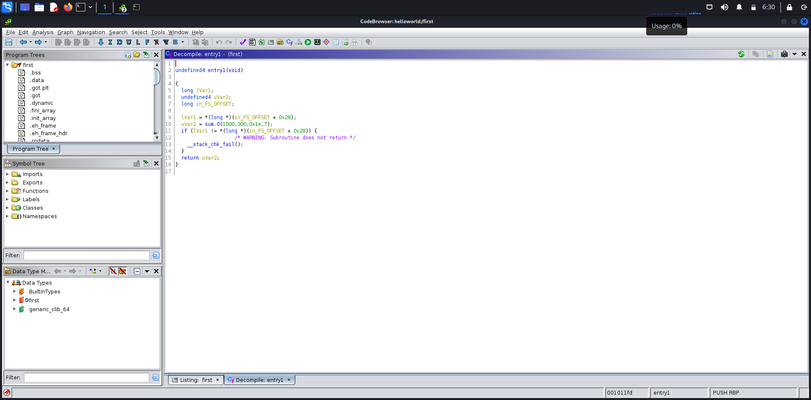
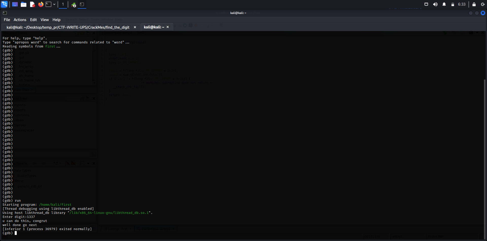

# CrackMe Find_The_Digit
in this project we need to find the right digit and feed it to the binary to solve the challenge.

first we put the binary in ghidra and find it's main function.

in the main function we immediately see a function called **check**, we could guess that this function does the actual validation, in order to validate a value, the program needs to compare it with another value so we need to look for a *CMP* instruction.

we can see that two arguments passed to the check function are being compared to each other so we need to find what they are, before the check function registers ESI and EDI get filled by EAX and EBX registers, EAX is the return value of a function so we can be certain that EAX contains the value that we gave to the program because the INPUT function is responsible for asking for input, all that remains is the EBX which we can see that the entry function will store it's result in it.

the entry function will call another function called **sum.0**, if we look at the sum function in the compiler we can see that it returns the sum of four values (1000,300,0x1e,7) which is **1337**. so the value that the program expects us is 1337.

result:

