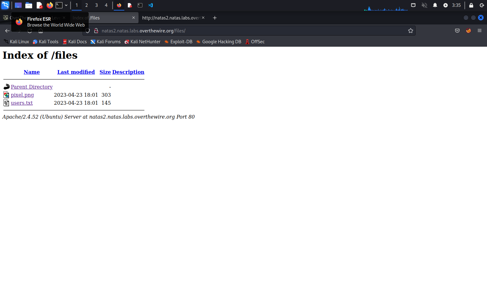
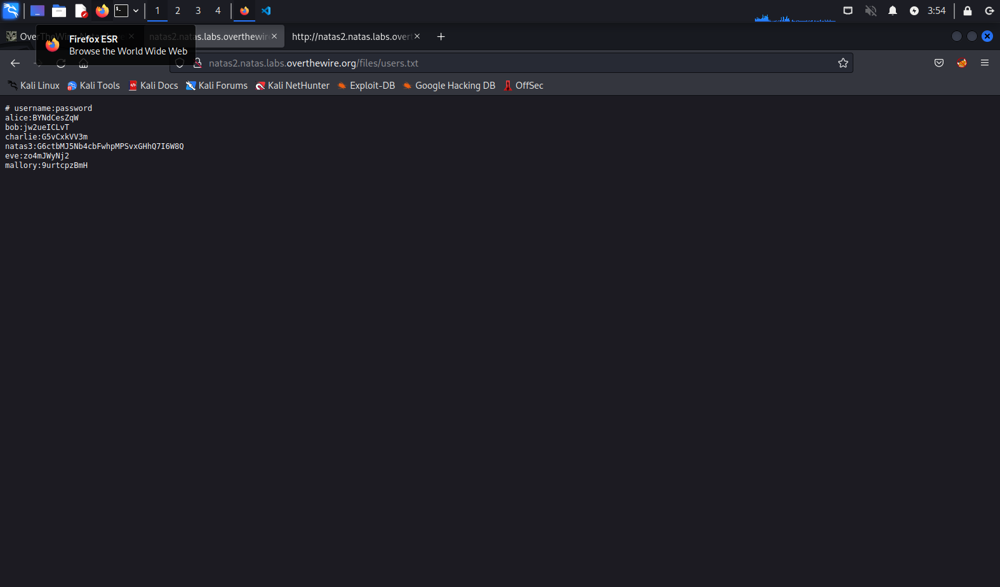

if we look at the source of the page we can see an image tag:
<img src="files/pixel.png"

if we navigate to the /files page it will list all the files available.

there are two files available in this directory:
1. pixel.png
2. users.txt

if we open the users.txt file we will find natas3's password
