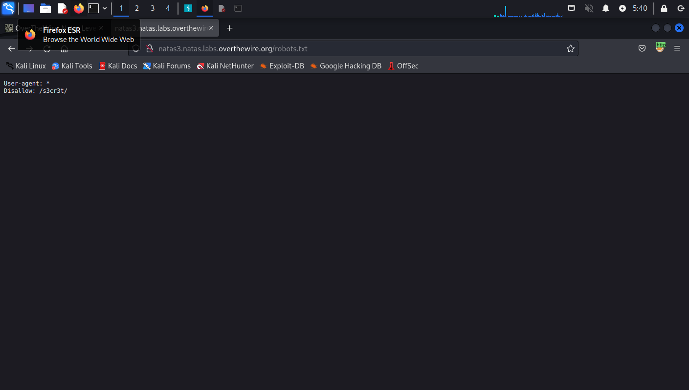
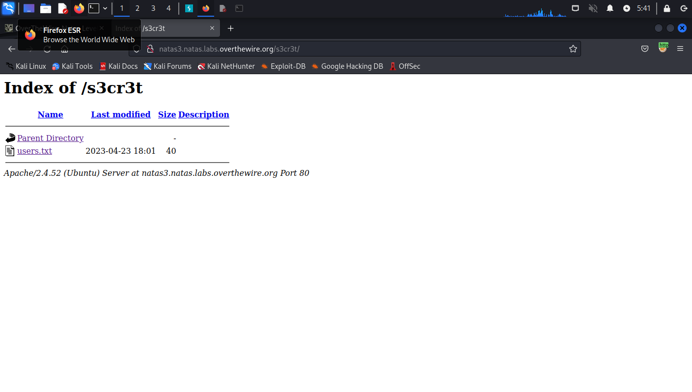
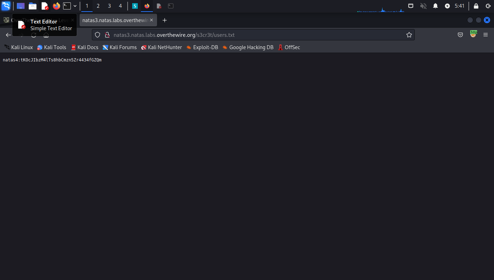

if we look at the source code of this page we can find a comment that says:

"No more information leaks!! Not even Google will find it this time..."

this comment gives us a clue about search engines which gives us a clue about the robots.txt file.
if we navigate to the robots.txt we can find a directory named s3cr3t:

there is a users.txt file inside the s3cr3t directory:

which contains our solution:
