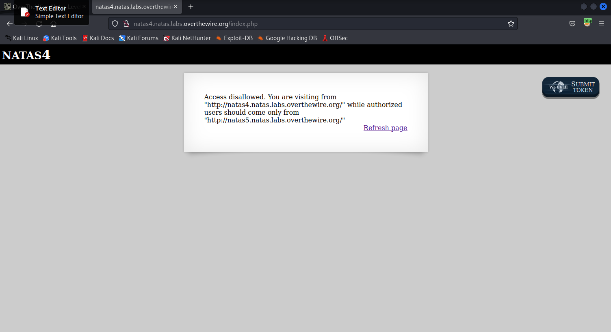
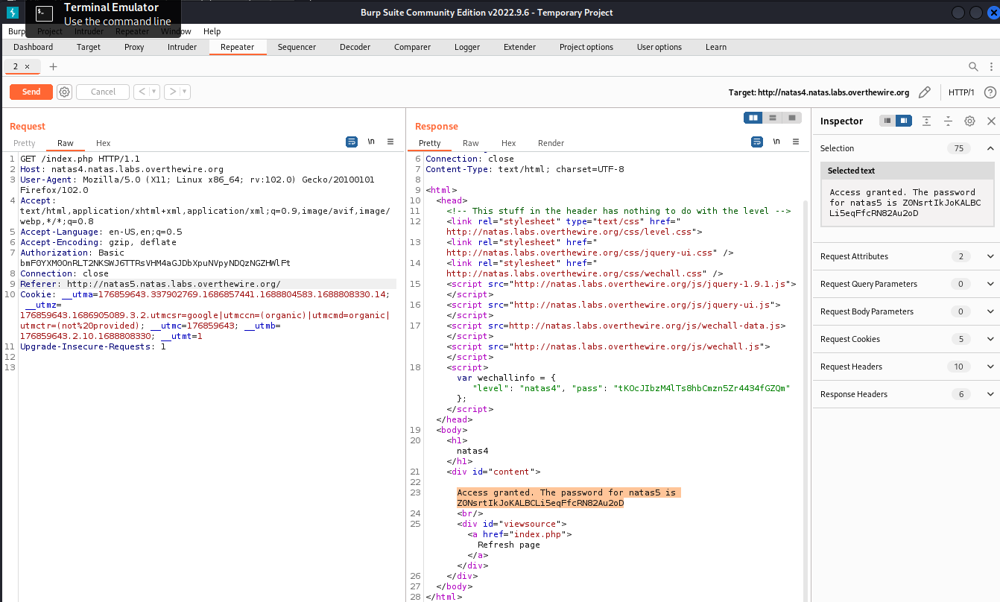

in this challenge we can see that it's telling us that we don't authorization to the page.

if we refresh the page and intercept the traffic with burpsuite, we can see that there is a cookie named logedin that's been set to zero, we will change it to one.
then we will have the correct authorization and we can see the solution:
